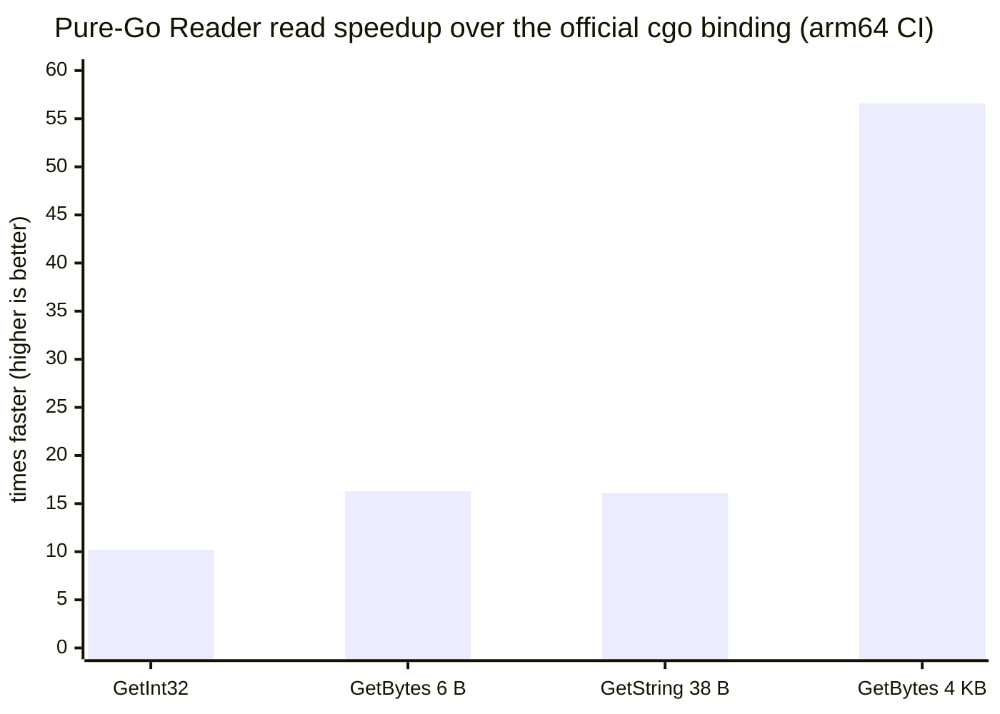

# mmkv-go

A **cgo-free, full read+write** implementation of
[Tencent MMKV](https://github.com/Tencent/MMKV) for Go — not just a reader. The
`MMKV` type writes and reads the official on-disk format and speaks the same
flock protocol, so it shares files with the C++ library across processes; a
specialized zero-copy `Reader` covers read-only consumers. Nothing crosses the
cgo boundary: reads are an order of magnitude faster than the official Go
binding (zero allocs on the view paths) and small writes beat it too (no
per-call cgo overhead).

```go
import "github.com/catundercar/mmkv-go"

// read+write — MMKV semantics end to end: append fast path, single-key
// override, periodic compaction; add mmkv.WithMultiProcess() to share the
// file with other processes (Go or C++):
m, err := mmkv.MMKVWithID("/path/to/mmkv/dir", "myID")
if err != nil { /* ... */ }
defer m.Close()
_ = m.SetString("name", "value")
_ = m.SetInt32("count", 42)
s, ok := m.GetString("name")
_ = m.Sync() // durable msync, like MMKV's sync(MMKV_SYNC)

// read-only, zero-copy, lock-free reads (e.g. a metrics/inspector sidecar):
r, err := mmkv.Open("/path/to/mmkv/dir", "myID")
// encrypted: mmkv.Open(dir, id, mmkv.WithEncryption([]byte(cryptKey)))
if err != nil { /* ... */ }
defer r.Close()
v, ok := r.GetBytes("key")   // []byte view into the reader's buffer, zero-copy
```

Freshness is transparent (like MMKV C++): each read cheaply checks the writer's
change canary in the mmap'd `.crc` and reloads only when something changed.
Cross-process single-writer + multi-reader is gated in CI with the writer on
either side (cgo or pure Go).

## Features

- **Typed key-values:** `bool`, `int32/64`, `uint32/64`, `float32/64`, `string`,
  `[]byte`, `[]string` (MMKV's `vector<string>`); zero-copy `GetBytes`/`GetString`
  views plus `*Copy` variants; `GetValueSize`/`WriteValueToBuffer` introspection.
- **MMKV write semantics, faithfully:** append fast path with incremental CRC,
  single-key override (MMKV ≥1.3.x), periodic compaction with future-usage
  headroom (`expandAndWriteBack`), `Trim`, `ClearAll`, durable `Sync` / async
  `Async`.
- **Cross-process:** `WithMultiProcess` flock interlock (shared reads,
  exclusive writes), transparent reload, public `Lock`/`TryLock`/`Unlock`,
  content-changed handler.
- **Encryption:** AES-CFB-128/256 (`WithCryptKey`, width follows key length,
  like MMKV), `ReKey` (plaintext ↔ encrypted, key rotation), fresh random IV
  per write-back; the Reader also accepts a custom `Decryptor`.
- **Key expiration:** `EnableAutoKeyExpire`/`DisableAutoKeyExpire`; expired keys
  read as absent, both here and in C++.
- **Recovery & safety:** last-confirmed snapshot rollback on torn writes,
  `WithRecoverOnError` salvage with an immediate repair write-back,
  `WithReadOnly` mode, `EnableCompareBeforeSet`.
- **Management:** `NameSpace`, `ImportFrom`, `BackupOne`/`RestoreOneFromDirectory`/
  `RemoveStorage`/`CheckExist`/`IsFileValid`, `Count`/`AllKeys`/`Contains`/
  `TotalSize`/`ActualSize`, `ClearMemoryCache`.

## Performance

Numbers below are from this repo's CI matrix (GitHub-hosted **native arm64**
runner, MMKV v2.4.0 cell, Go 1.25, `go test -bench`). The pure-Go read path
skips both the cgo boundary and the copy — a read collapses to a map lookup
plus an mmap view — so latency is flat (~19–34 ns) **regardless of value
size**, while the cgo binding pays the call overhead plus a copy that grows
with the value:



| read (ns/op, arm64) | cgo binding | cgo zero-copy API | pure `Reader` (view) | pure `MMKV` type | `Reader` speedup |
|---|--:|--:|--:|--:|--:|
| `GetInt32`          | 215.6 |     — | **21.1** | 33.7 | **10×** |
| `GetBytes` (6 B)    | 307.1 |     — | **18.9** |    — | **16×** |
| `GetString` (38 B)  | 310.7 | 292.9 | **19.3** | 32.2 | **16×** |
| `GetBytes` (4 KB)   |  1161 | 383.2 | **20.5** | 34.2 | **57×** |

- Every pure-Go view read is **0 B/op, 0 allocs/op**. The cgo binding's default
  getters copy (a 4 KB read allocates 4104 B over 2 allocs), and even its
  zero-copy buffer API (`GetBytesBuffer`+`Destroy`) stays **15–19× behind**.
- amd64 shows the same shape: **7× / 14× / 13× / 44×** for the four reads above.
- When you need to retain data past the next write, the `*Copy` variants still
  beat the cgo copy path: `GetStringCopy` 45.8 ns, 4 KB `GetBytesCopy` 848.7 ns
  (vs 1161 ns via cgo).
- Writes win too (no per-call cgo overhead): `SetInt32` **139 ns vs 1179 ns**
  on arm64 (~8×), 155 ns vs 805 ns on amd64 (~5×).

Full methodology, history, and the multi-process concurrency results:
[doc/BENCHMARK.md](doc/BENCHMARK.md), plus the per-version × arch tables in
each CI run's job summary.

## Scope

- **Platform:** POSIX (Linux/macOS), Go 1.23+.
- **Out of scope:** Windows and Android-specific backends (ashmem); anything
  not listed above — the official cgo library remains the reference for those.

See [doc/DESIGN.md](doc/DESIGN.md) for the on-disk format spec and boundaries,
[doc/MMKV_FULL_DESIGN.md](doc/MMKV_FULL_DESIGN.md) for the read+write type's
design, and [doc/BENCHMARK.md](doc/BENCHMARK.md) for performance.

## Why it's correct (and stays correct)

The headline guarantee is **bidirectional equivalence with the official
library**: a value written by cgo reads back identically through this package
(`cgo.Get(k) == purego.Get(k)`), and a file written by this package reads back
identically through cgo — including encrypted and expiring stores. CI enforces
both directions per MMKV version × architecture (`harness/`), so a format
change in any MMKV release that breaks either side turns the build red.

## Compatibility

CI verifies the equivalence guarantee against the latest tag of each MMKV
release line, on both **amd64** and **arm64** (native runners):

| MMKV line | tested tag | note |
|---|---|---|
| v1.2.x | `v1.2.16` | earliest line tested |
| v1.3.x | `v1.3.16` | format v4 / key expiration introduced |
| v2.0.x | `v2.0.2` | |
| v2.1.x | `v2.1.1` | namespace |
| v2.2.x | `v2.2.4` | |
| v2.3.x | `v2.3.0` | AES-256 |
| v2.4.x | `v2.4.0` | latest |

On-disk **format versions 0–4** are supported for reading. The format has been
stable at v4 since v1.3.0, so files from current MMKV releases read correctly; a
future format bump surfaces as `ErrUnsupportedVersion` (never silent corruption)
and turns the CI differential red. The pure-Go **writer emits format v4**, so
the write-direction differential is gated from v1.3 on (pre-v1.3 MMKV cannot
read v4 files). Encryption (AES-CFB-128/256) and key expiration are
differential-tested in both directions on `v2.4.0`; their on-disk format is
version-stable.

**Requires** Go 1.23+ and a POSIX OS (Linux/macOS).

## Layout

```
.                      pure-Go library (package mmkv) + unit tests + testdata/
doc/                   DESIGN.md, MMKV_FULL_DESIGN.md, BENCHMARK.md (+ zh-CN)
harness/               cgo module: cgo≡purego gate, -race concurrency, 3-way Go bench
cpp/                   native C++ baseline (bench_cpp.cpp, build.sh)
tools/gen/             cgo module: regenerate testdata fixtures
scripts/               build_output.sh, run_cell.sh, aggregate.py
.github/workflows/     CI matrix (versions × {amd64, arm64})
```

The root module is **pure Go with no cgo dependency**, so `go get` never pulls
the C libraries, and `go test ./...` works out of the box (the cgo modules are
excluded as separate modules). Everything that needs cgo (`harness/`,
`tools/gen/`) is its own module with self-contained `replace` directives. For
cross-module local dev, after building `MMKV/output` run
`go work init . ./harness ./tools/gen` (go.work is gitignored).

## Testing & benchmarks

CI runs a matrix over MMKV's major version lines × {amd64, arm64} on native
runners. Each cell builds that MMKV version, runs the functional gate (hard
fail), then the three-way performance comparison (C++ / cgo / purego).

```sh
# one cell locally (needs git, cmake, g++, zlib dev, Go):
bash scripts/build_output.sh v2.4.0          # clone+build MMKV into ./MMKV/output
bash scripts/run_cell.sh   v2.4.0 arm64      # gate + perf -> results/
python3 scripts/aggregate.py results         # merge -> markdown report
```

Pure-Go unit tests need no cgo: `go test ./...`.

## License

MIT. MMKV itself is BSD-3-Clause; this is a clean-room implementation of its
on-disk format and locking protocol.
