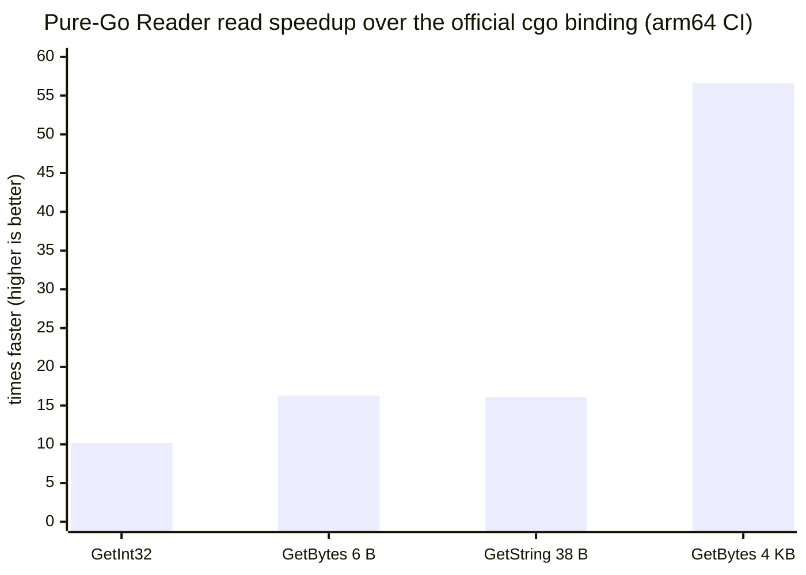

# mmkv-go

> [English](README.md) · **中文**

[](https://pkg.go.dev/github.com/catundercar/mmkv-go)
[](https://github.com/catundercar/mmkv-go/actions/workflows/ci.yml)
[](https://goreportcard.com/report/github.com/catundercar/mmkv-go)
[](LICENSE)

一个**无 cgo、全功能读写**的
[腾讯 MMKV](https://github.com/Tencent/MMKV) Go 实现 —— 不只是读。`MMKV` 类型
按官方磁盘格式读写，并遵循同一套 flock 协议,因此能与 C++ 库**跨进程共享同一批文件**;
另有一个零拷贝的 `Reader` 专供只读消费方。整条路径不穿过 cgo:读比官方 Go binding
快一个数量级(view 路径零分配),小写入也更快(没有每次调用的 cgo 开销)。

```go
import "github.com/catundercar/mmkv-go"

// 读 + 写 —— 端到端的 MMKV 语义:append 快路径、单 key 覆盖、周期 compaction;
// 加上 mmkv.WithMultiProcess() 即可与其他进程(Go 或 C++)共享文件:
m, err := mmkv.MMKVWithID("/path/to/mmkv/dir", "myID")
if err != nil { /* ... */ }
defer m.Close()
_ = m.SetString("name", "value")
_ = m.SetInt32("count", 42)
s, ok := m.GetString("name")
_ = m.Sync() // 持久化 msync,等同 MMKV 的 sync(MMKV_SYNC)

// 只读、零拷贝、无锁读(例如 metrics / inspector sidecar):
r, err := mmkv.Open("/path/to/mmkv/dir", "myID")
// 加密文件: mmkv.Open(dir, id, mmkv.WithEncryption([]byte(cryptKey)))
if err != nil { /* ... */ }
defer r.Close()
v, ok := r.GetBytes("key")   // 指向 reader 内部缓冲的 []byte 视图,零拷贝
```

刷新是透明的(对齐 MMKV C++):每次读会廉价地检查 mmap 后 `.crc` 里写进程的变更探针,
仅在有变更时才 reload。单写多读的跨进程场景在 CI 中受双向门禁(写端可以是 cgo 或纯 Go)。

## 何时该用

适合 `mmkv-go` 的场景:

- 你有 C++/Android/iOS 写出的 MMKV 文件,需要**在 Go 里读写同一批文件** ——
  跨进程、跨语言共享数据,无需格式转换。
- 读多写少、长期持有并复用 `Reader`:你要的是**个位数到几十纳秒、零分配的读**,
  而不是每次调用都拷贝一份。
- 你想**摆脱 cgo**:纯 Go 构建、轻松交叉编译、`go test ./...` 开箱即用。

不适合、请用别的:

- 只是想要一个 Go 嵌入式 KV、不需要 MMKV 格式兼容 —— 用
  [bbolt](https://github.com/etcd-io/bbolt)、
  [badger](https://github.com/dgraph-io/badger) 或
  [pebble](https://github.com/cockroachdb/pebble)。
- 需要 **Windows** 或 **Android ashmem** 后端 —— 那里官方 cgo 库仍是基准。
- 访问模式是 开 → 读一次 → 关:parse-once 成本是 O(文件大小),摊销不成立。

## 特性

- **类型化键值:** `bool`、`int32/64`、`uint32/64`、`float32/64`、`string`、
  `[]byte`、`[]string`(MMKV 的 `vector<string>`);零拷贝 `GetBytes`/`GetString`
  视图 + `*Copy` 变体;`GetValueSize`/`WriteValueToBuffer` 自省接口。
- **忠实的 MMKV 写语义:** 带增量 CRC 的 append 快路径、单 key 覆盖(MMKV ≥1.3.x)、
  带 future-usage 余量的周期 compaction(`expandAndWriteBack`)、`Trim`、`ClearAll`、
  持久 `Sync` / 异步 `Async`。
- **跨进程:** `WithMultiProcess` flock 互锁(共享读、排他写)、透明 reload、公开的
  `Lock`/`TryLock`/`Unlock`、内容变更 handler。
- **加密:** AES-CFB-128/256(`WithCryptKey`,宽度随 key 长度,对齐 MMKV)、`ReKey`
  (明文 ↔ 加密、轮换密钥)、每次 write-back 用新的随机 IV;`Reader` 也接受自定义
  `Decryptor`。
- **key 过期:** `EnableAutoKeyExpire`/`DisableAutoKeyExpire`;过期 key 在本库与 C++
  两侧都读作不存在。
- **恢复与安全:** 撕裂写时回滚到 last-confirmed 快照、`WithRecoverOnError` 抢救并
  立即 repair 回写、`WithReadOnly` 模式、`EnableCompareBeforeSet`。
- **管理:** `NameSpace`、`ImportFrom`、`BackupOne`/`RestoreOneFromDirectory`/
  `RemoveStorage`/`CheckExist`/`IsFileValid`、`Count`/`AllKeys`/`Contains`/
  `TotalSize`/`ActualSize`、`ClearMemoryCache`。

## 性能

下列数字来自本仓库 CI 矩阵(GitHub 托管的**原生 arm64** runner、MMKV v2.4.0 单元、
Go 1.25、`go test -bench`)。纯 Go 读路径同时跳过了 cgo 边界与拷贝 —— 一次读坍缩为
一次 map 查 + 一个 mmap 视图 —— 所以延迟是平的(~19–34 ns)、**与 value 大小无关**;
而 cgo binding 要付调用开销,外加一次随 value 增大的拷贝:



| 读(ns/op, arm64) | cgo binding | cgo 零拷贝 API | 纯 `Reader`(视图) | 纯 `MMKV` 类型 | `Reader` 提速 |
|---|--:|--:|--:|--:|--:|
| `GetInt32`          | 215.6 |     — | **21.1** | 33.7 | **10×** |
| `GetBytes`(6 B)    | 307.1 |     — | **18.9** |    — | **16×** |
| `GetString`(38 B)  | 310.7 | 292.9 | **19.3** | 32.2 | **16×** |
| `GetBytes`(4 KB)   |  1161 | 383.2 | **20.5** | 34.2 | **57×** |

- 每次纯 Go 视图读都是 **0 B/op、0 allocs/op**。cgo binding 的默认 getter 会拷贝
  (一次 4 KB 读分配 4104 B / 2 allocs),即便它的零拷贝缓冲 API(`GetBytesBuffer`+
  `Destroy`)也仍**落后 15–19×**。
- amd64 形状相同:上述四项读分别为 **7× / 14× / 13× / 44×**。
- 当数据需要留到下次写之后,`*Copy` 变体仍胜过 cgo 拷贝路径:`GetStringCopy`
  45.8 ns、4 KB `GetBytesCopy` 848.7 ns(cgo 为 1161 ns)。
- 写也赢(没有每次调用的 cgo 开销):arm64 上 `SetInt32` **139 ns vs 1179 ns**
  (~8×),amd64 上 155 ns vs 805 ns(~5×)。

完整方法论、历史数据与多进程并发结果见
[doc/BENCHMARK.zh-CN.md](doc/BENCHMARK.zh-CN.md),以及每次 CI run job summary 里的
版本 × 架构 表。

## 适用范围

- **平台:** POSIX(Linux/macOS),Go 1.23+。
- **不在范围内:** Windows、Android 专有后端(ashmem);以及上面未列出的一切 ——
  那些以官方 cgo 库为准。

磁盘格式规范与边界见 [doc/DESIGN.zh-CN.md](doc/DESIGN.zh-CN.md),读写类型的设计见
[doc/MMKV_FULL_DESIGN.zh-CN.md](doc/MMKV_FULL_DESIGN.zh-CN.md),性能见
[doc/BENCHMARK.zh-CN.md](doc/BENCHMARK.zh-CN.md)。

## 为什么它正确(并持续正确)

最核心的保证是**与官方库的双向等价**:cgo 写入的值,经本包读回完全一致
(`cgo.Get(k) == purego.Get(k)`);本包写入的文件,经 cgo 读回也完全一致 ——
加密与过期存储同样如此。CI 按 MMKV 版本 × 架构强制校验两个方向(`harness/`),
任何一个 MMKV 版本里破坏任一方向的格式变更,都会让 build 变红。

## 兼容性

CI 针对每条 MMKV 发布线的最新 tag、在 **amd64** 与 **arm64**(原生 runner)上
校验等价性保证:

| MMKV 线 | 测试 tag | 说明 |
|---|---|---|
| v1.2.x | `v1.2.16` | 测试的最早一线 |
| v1.3.x | `v1.3.16` | 引入格式 v4 / key 过期 |
| v2.0.x | `v2.0.2` | |
| v2.1.x | `v2.1.1` | namespace |
| v2.2.x | `v2.2.4` | |
| v2.3.x | `v2.3.0` | AES-256 |
| v2.4.x | `v2.4.0` | 最新 |

读支持**磁盘格式版本 0–4**。格式自 v1.3.0 起稳定在 v4,所以当前 MMKV 版本的文件都能
正确读取;未来格式升级会以 `ErrUnsupportedVersion` 暴露(绝不静默损坏)并让 CI 差分
变红。纯 Go **写端输出格式 v4**,因此写方向差分自 v1.3 起受门禁(v1.3 之前的 MMKV
读不了 v4 文件)。加密(AES-CFB-128/256)与 key 过期在 `v2.4.0` 上双向差分测试;
其磁盘格式版本稳定。

**要求** Go 1.23+ 与 POSIX 系统(Linux/macOS)。

## 目录结构

```
.                      纯 Go 库(package mmkv)+ 单测 + testdata/
doc/                   DESIGN.md、MMKV_FULL_DESIGN.md、BENCHMARK.md(+ zh-CN)
harness/               cgo 模块:cgo≡purego 门禁、-race 并发、三方 Go bench
cpp/                   原生 C++ 基线(bench_cpp.cpp、build.sh)
tools/gen/             cgo 模块:重新生成 testdata fixtures
scripts/               build_output.sh、run_cell.sh、aggregate.py
.github/workflows/     CI 矩阵(版本 × {amd64, arm64})
```

根模块是**纯 Go、无 cgo 依赖**,所以 `go get` 永远不会拉 C 库,`go test ./...`
开箱即用(cgo 模块作为独立模块排除在外)。一切需要 cgo 的部分(`harness/`、
`tools/gen/`)都是各自独立的模块、自带 `replace` 指令。跨模块本地开发时,构建出
`MMKV/output` 后执行 `go work init . ./harness ./tools/gen`(go.work 已 gitignore)。

## 测试与基准

CI 在 MMKV 各大版本线 × {amd64, arm64} 的矩阵上、于原生 runner 运行。每个单元构建
对应 MMKV 版本,先跑功能门禁(硬失败),再跑三方性能对比(C++ / cgo / purego)。

```sh
# 本地单个单元(需要 git、cmake、g++、zlib dev、Go):
bash scripts/build_output.sh v2.4.0          # clone+build MMKV 到 ./MMKV/output
bash scripts/run_cell.sh   v2.4.0 arm64      # 门禁 + 性能 -> results/
python3 scripts/aggregate.py results         # 合并 -> markdown 报告
```

纯 Go 单测不需要 cgo:`go test ./...`。

## 许可

MIT。MMKV 本身为 BSD-3-Clause;本项目是对其磁盘格式与锁协议的 clean-room(净室)实现。
