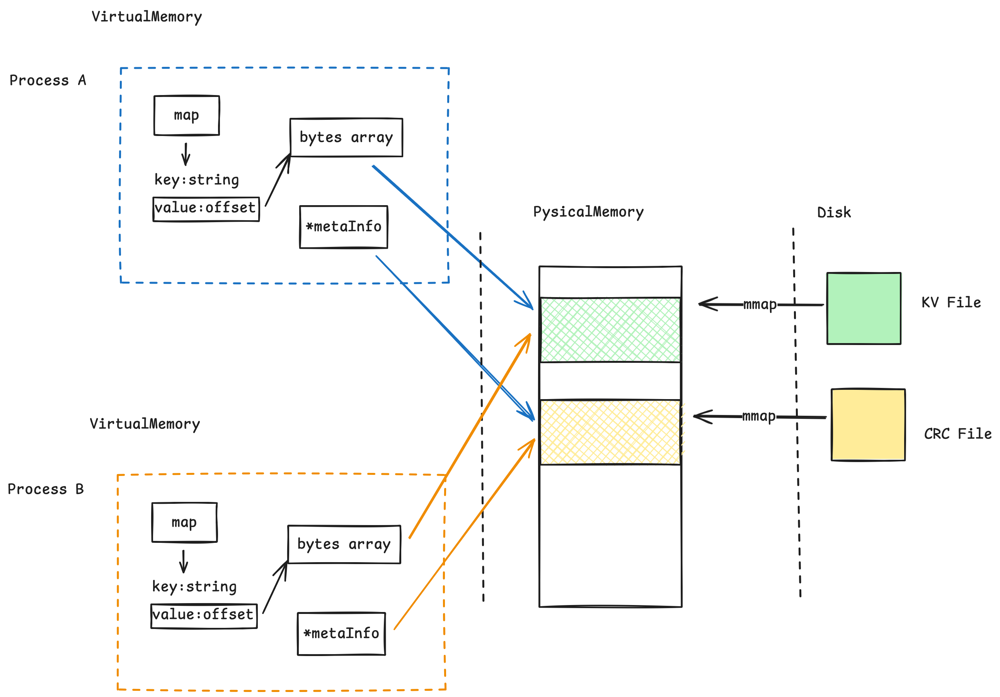

# MMKV 日知录
## 初识 MMKV

MMKV 是腾讯开源的基于 mmap 内存映射的 key-value 组件，底层实现是基于内存映射的文件，因此其性能很高，可以支持 1000 万级别的高性能读写。

MMKV 的特性：

- 支持多进程并发读写
- 支持多进程数据共享
- 支持数据持久化
- 支持数据加密
- 支持数据压缩
- 支持数据迁移

## MMKV 整体架构

MMKV 是一个基于 **mmap** 的键值存储引擎。通过
